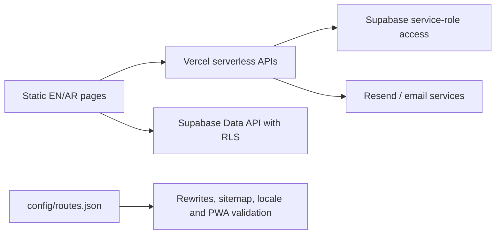

# NexCore Labs

[](https://github.com/NexCore-Labs-Initiative/NexCore/actions/workflows/ci.yml)
[](LICENSE)

NexCore Labs is a public, bilingual student-community platform centered on Sultan Qaboos University and Oman. It helps people discover projects and initiatives, contribute ideas, and manage their own published work. NexCore Labs is independent and is not operated, sponsored, or endorsed by SQU.

**Empower our SQU Community to do more.**

Production: [nexcorelabs.vercel.app](https://nexcorelabs.vercel.app)
Current release: **[v3.3.0 — Trust & Foundations](https://github.com/NexCore-Labs-Initiative/NexCore/releases/tag/v3.3.0)**

## Product status

- Project Hub, initiatives, Contributor Center, roadmap, authentication, member dashboard, and account tools are active.
- NexCore Intelligence is under development and is not a v3.3 product launch.
- Paid ordering is paused. Pricing and billing-policy pages remain available for transparent historical/legal context.
- English and Arabic public routes are maintained as tested pairs.
- Vercel is the sole canonical host. GitHub Pages is not a supported deployment.

## Architecture



The platform intentionally retains a flat multi-page HTML architecture. Shared navigation/footer behavior is synchronized at build time, while sensitive data access is mediated by serverless APIs. See [Architecture](docs/architecture.md) and [Database security](docs/database.md).

## Local setup

Requirements: Node.js 22+, npm, and a modern browser.

```powershell
npm.cmd ci
npm.cmd run shell:sync
npm.cmd run assets:build
npm.cmd test
npm.cmd run routes:test
npm.cmd run release:evidence
npm.cmd run security:audit
```

For browser checks:

```powershell
npx.cmd playwright install chromium
npm.cmd run browser:test
```

The static UI can be served with `npx.cmd http-server . -p 4173 -c-1`. Serverless APIs require Vercel development or a preview deployment with the environment variables below.

## Environment variables

Only names belong in documentation; never commit values.

| Name | Purpose | Scope |
|---|---|---|
| `SUPABASE_URL` | Supabase project URL | Server |
| `SUPABASE_ANON_KEY` or `SUPABASE_PUBLISHABLE_KEY` | User-token validation | Server/public client as configured |
| `SUPABASE_SERVICE_ROLE_KEY` | Privileged server database operations | Server secret only |
| `RESEND_API_KEY` | Newsletter/email delivery | Server secret only |
| `EMAIL_USER`, `EMAIL_PASS` | Legacy mail transport, if still used | Server secret only |
| `SCANNER_CODE_SECRET` | Project scan-code signing | Server secret only |
| `GEMINI_API_KEY`, `GEMINI_MODEL` | Paused Intelligence backend | Server secret only; remove if unused |

PayPal variables are obsolete while payments remain paused and should not exist in production unless a future reviewed release restores that integration.

## Repository map

- `*.html`, `ar/*.html` — paired static pages.
- `assets/` — shared styles, scripts, images, and release data.
- `api/` — Vercel serverless endpoints.
- `lib/api/` — shared authentication, validation, errors, rate limiting, and logging.
- `config/routes.json` — canonical route registry.
- `supabase/migrations/` — only executable database schema source of truth.
- `scripts/`, `tests/` — regression, route, release-evidence, security-contract, and browser checks.
- `docs/` — architecture, database, deployment, and release runbooks.

## Contributing and security

Start with [CONTRIBUTING.md](CONTRIBUTING.md). Report vulnerabilities privately using [SECURITY.md](SECURITY.md); do not open public security issues. All changes use short-lived `codex/*` or contributor branches, a pull request, and required CI checks.

Licensed under the [MIT License](LICENSE).
